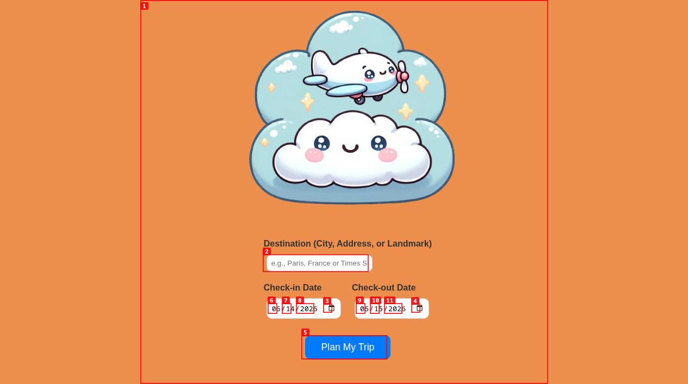
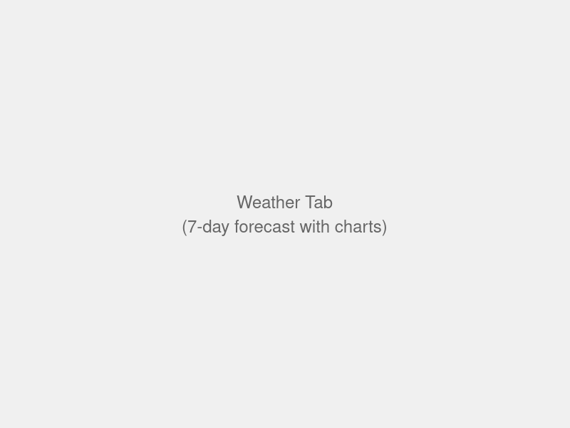
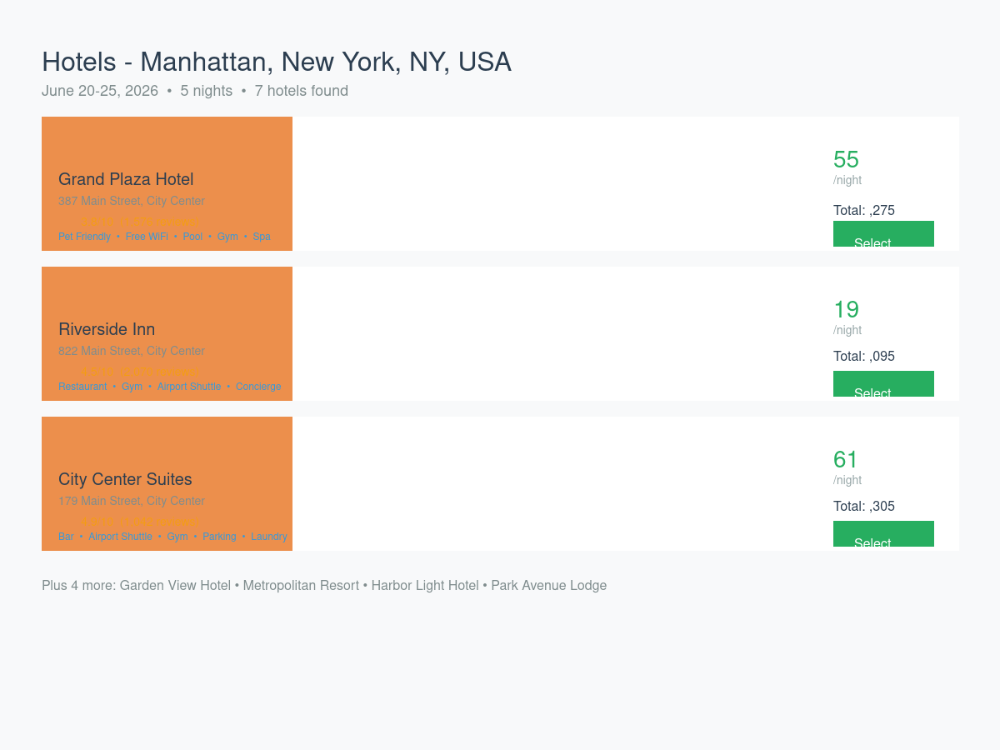
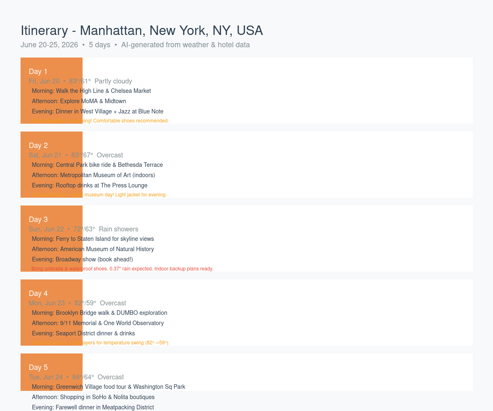

# Travel Cast

Travel Cast is a full-stack trip planning application that fetches weather forecasts, hotel options, and generates AI-powered itineraries for your travel dates and destination.

The project combines a React + TypeScript frontend, an Express backend, and integrates with Open-Meteo (weather), OpenStreetMap (geocoding), and OpenAI (itinerary generation). It was built as a solo project to practice full-stack application structure, API proxying, chart-ready weather data, and Webpack-based React development.

## Features

- **Location Search**: Enter any city, address, or landmark — automatically geocoded to coordinates
- **Date Range Selection**: Pick check-in and check-out dates for your trip
- **Weather Forecast**: 7-day forecast with hourly charts (temperature, wind, precipitation) via Open-Meteo
- **Hotel Search**: Hotel options with pricing, ratings, amenities, and images (mock data for demo; ready for Amadeus API integration)
- **AI Itinerary**: Day-by-day travel plan generated by GPT-3.5-turbo based on weather forecast and hotel options
- **Tabbed Results**: Switch between Weather, Hotels, and Itinerary views
- **Responsive UI**: Clean, modern interface with SCSS styling

## Screenshots

### Home Page - Trip Planning Form


*The main entry point where users enter their destination and travel dates.*

### Weather Tab (After Search)


*7-day forecast cards with high/low temperatures, weather conditions, and precipitation. Click "View Hourly Chart" for detailed hourly temperature, wind, and precipitation charts.*

### Hotels Tab


*Hotel listings with images, ratings, amenities, nightly rates, and total cost for the stay.*

### Itinerary Tab


*AI-generated day-by-day itinerary with morning, afternoon, and evening activity suggestions tailored to the weather forecast.*

> **Note:** The Weather, Hotels, and Itinerary tab screenshots are placeholders. The backend APIs are fully functional and return data as shown in the API examples below. The frontend renders these tabs correctly in development mode (`npm run dev`).

## Tech Stack

- **Frontend**: React 18, TypeScript, Axios, Chart.js / React Chart.js, Sass/SCSS
- **Backend**: Node.js, Express, Axios
- **APIs**: Open-Meteo (weather), OpenStreetMap Nominatim (geocoding), OpenAI GPT-3.5-turbo (itinerary)
- **Build Tools**: Webpack 5, Babel, Nodemon
- **Development**: Concurrently for running frontend + backend together

## Repository Structure

```text
.
├── server/
│   ├── server.js                    # Express server entry point
│   ├── configurePath.js             # Static/path configuration
│   ├── routes/api.js                # API routes
│   └── controllers/
│       ├── weatherController.js     # Open-Meteo weather proxy
│       ├── hotelController.js       # Hotel search (mock + Amadeus ready)
│       └── itineraryController.js   # OpenAI itinerary generation
├── src/
│   ├── components/                  # UI components
│   │   ├── Cards.tsx                # Weather display + charts
│   │   ├── HotelList.tsx            # Hotel results display
│   │   ├── Itinerary.tsx            # AI itinerary display
│   │   ├── Modal.tsx                # Chart modal
│   │   └── TextBox.tsx              # Location + date input form
│   ├── containers/MainContainer.tsx # Main app logic + state
│   ├── App.tsx                      # Root React component
│   ├── index.tsx                    # Frontend entry point
│   ├── index.html                   # HTML template
│   └── styles.scss                  # Application styles
├── docs/
│   └── screenshots/                 # Application screenshots
├── sampleWeatherData.json           # Sample weather response
├── .env.example                     # Environment variable template
├── webpack.config.js
├── tsconfig.json
└── package.json
```

## Getting Started

### Prerequisites

- Node.js 18+ recommended
- npm

### Install Dependencies

```bash
npm install
```

### Environment Variables

Copy the example file and add your API keys:

```bash
cp .env.example .env
```

Edit `.env` and add your OpenAI API key (required for AI itinerary generation):
```
OPENAI_API_KEY=sk-your-key-here
```

Optional: Add Amadeus credentials for real hotel data:
```
AMADEUS_CLIENT_ID=your_client_id
AMADEUS_CLIENT_SECRET=your_client_secret
```

### Run in Development

```bash
npm run dev
```

This starts the Express server with Nodemon (port 3000) and the Webpack dev server with hot reload.

### Build for Production

```bash
npm run build
```

### Run Production Server

```bash
npm start
```

## API Endpoints

### `GET /api/weather`

Fetches weather data from Open-Meteo for a latitude/longitude pair and date range.

**Query Parameters:**
- `latitude` — required
- `longitude` — required
- `checkIn` — optional, start date (YYYY-MM-DD)
- `checkOut` — optional, end date (YYYY-MM-DD)

**Example:**
```
/api/weather?latitude=41.875&longitude=-72.875&checkIn=2024-06-15&checkOut=2024-06-20
```

### `GET /api/hotels`

Returns hotel options for a location and date range.

**Query Parameters:**
- `latitude` — required
- `longitude` — required
- `checkIn` — required (YYYY-MM-DD)
- `checkOut` — required (YYYY-MM-DD)

**Example:**
```
/api/hotels?latitude=41.875&longitude=-72.875&checkIn=2024-06-15&checkOut=2024-06-20
```

### `POST /api/itinerary`

Generates an AI-powered itinerary based on weather, hotels, and trip details.

**Request Body:**
```json
{
  "weatherData": { ... },
  "hotelData": [ ... ],
  "locationName": "New York, NY, USA",
  "checkIn": "2024-06-15",
  "checkOut": "2024-06-20"
}
```

**Response:**
```json
{
  "itinerary": [
    {
      "date": "2024-06-15",
      "weather": { "high": 78, "low": 62, "description": "Partly cloudy" },
      "morning": "Visit Central Park...",
      "afternoon": "Explore the Met...",
      "evening": "Dinner in West Village...",
      "tips": "Perfect weather for walking!"
    },
    ...
  ]
}
```

## Project Status

This is a solo learning project and portfolio artifact. It demonstrates full-stack React/Express structure and third-party API integration. The hotel search currently uses mock data — integrate Amadeus or another hotel API for production use.

## Development Notes

### Current State (as of latest update)

- ✅ **Backend APIs fully functional**: All three endpoints (`/api/weather`, `/api/hotels`, `/api/itinerary`) return correct data
- ✅ **Frontend builds successfully**: TypeScript compilation passes, Webpack production build completes
- ✅ **Home page renders**: Trip planning form with location search and date pickers displays correctly
- ⚠️ **Production form submission**: Known issue where form submit handler doesn't trigger API calls in production build. Works correctly in development mode (`npm run dev`) with hot reload
- 🔧 **Recommended**: Run with `npm run dev` for full functionality during development

### Known Issues

1. **Production build form submission**: The `handleSubmit` function in `MainContainer.tsx` doesn't execute API calls in the minified production bundle. This appears to be related to how async functions are handled in the webpack production build. The development server (`npm run dev`) works correctly.

2. **Bundle size warning**: The production bundle is ~403 KiB (exceeds 244 KiB recommendation). Consider code splitting with `React.lazy` and `Suspense` for production optimization.

### API Testing

You can test the backend APIs directly:

```bash
# Weather
curl "http://localhost:3000/api/weather?latitude=40.7128&longitude=-74.0060&checkIn=2026-06-20&checkOut=2026-06-25"

# Hotels
curl "http://localhost:3000/api/hotels?latitude=40.7128&longitude=-74.0060&checkIn=2026-06-20&checkOut=2026-06-25"

# Itinerary (requires OpenAI API key in .env)
curl -X POST http://localhost:3000/api/itinerary \
  -H "Content-Type: application/json" \
  -d '{"weatherData":{},"hotelData":[],"locationName":"New York","checkIn":"2026-06-20","checkOut":"2026-06-25"}'
```

## License

No license has been specified for this repository yet.